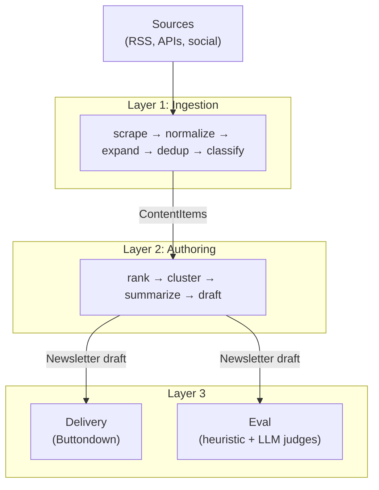

# Astral Index

An AI-generated space technology newsletter. Scrapes 70+ space industry sources, uses LLMs to summarize and editorialize, and publishes a curated weekly digest via [Buttondown](https://buttondown.com/).

Inspired by [The Orbital Index](https://orbitalindex.com/) (350 issues, 2019–2026) and [smol.ai's AI News](https://buttondown.com/ainews).

## How it works

A three-layer pipeline ingests raw content, generates an editorial newsletter, and delivers it:



**Ingestion** pulls from ~25 RSS feeds, the Spaceflight News API, Reddit, arXiv, Bluesky, and Twitter/X. Excerpt-only items are expanded to full text via a three-stage cascade (trafilatura → newspaper4k → readability). Items are classified into 12 space categories using keyword matching with an LLM fallback.

**Authoring** scores and selects the top items, clusters them into editorial sections, generates summaries (Claude Sonnet or excerpt-only), and assembles a markdown newsletter draft.

**Delivery** publishes drafts through the Buttondown API. **Eval** scores drafts across 8 dimensions (3 heuristic + 5 LLM judges) to guide iteration on prompts and strategy.

See [ARCHITECTURE.md](ARCHITECTURE.md) for the full design document, data flow, source coverage, and roadmap.

## Project structure

Monorepo using [uv workspaces](https://docs.astral.sh/uv/concepts/workspaces/):

```
packages/
├── core/       # astral-core    — shared models and storage (ContentItem, ContentStore)
├── ingest/     # astral-ingest  — scrapers, link expansion, classification, CLI
├── author/     # astral-author  — newsletter generation pipeline
├── serve/      # astral-serve   — Buttondown publishing
└── eval/       # astral-eval    — heuristic + LLM quality scoring
```

## Quick start

Requires Python 3.14+ and [uv](https://docs.astral.sh/uv/).

```bash
# Install all packages
uv sync --all-packages

# Install pre-commit hooks (prek is recommended — faster, no Python dependency)
prek install  # or: uv run pre-commit install

# Copy and fill in credentials (all optional)
cp .env.example .env

# Scrape all sources (no API keys needed for RSS/SNAPI/arXiv/Bluesky)
uv run --package astral-ingest astral-ingest scrape

# Expand excerpt-only items to full text
uv run --package astral-ingest astral-ingest expand --since 7

# Generate a newsletter (no LLM needed)
uv run --package astral-author astral-author draft --since 7 --strategy headlines-only

# Run tests
uv run pytest -v
```

See [AGENTS.md](AGENTS.md) for the full CLI reference and development guidelines.

## Credentials

All optional — each feature degrades gracefully without its key. Copy [`.env.example`](.env.example) to `.env` and fill in what you need:

| Variable | Used for |
|----------|----------|
| `ANTHROPIC_API_KEY` | LLM classification (Haiku), summaries (Sonnet), eval judges |
| `REDDIT_CLIENT_ID` / `REDDIT_CLIENT_SECRET` | Reddit scraping |
| `SOCIALDATA_API_KEY` | Twitter/X scraping via SocialData.tools |
| `BUTTONDOWN_API_KEY` | Newsletter publishing |
| `BRAINTRUST_API_KEY` | Optional eval tracing |

## Contributing

The codebase is structured for easy extension:

- **Add a source** — add an entry to [`sources.yaml`](packages/ingest/src/astral_ingest/sources.yaml). No code changes needed for RSS feeds.
- **Add a scraper type** — implement `BaseScraper.fetch()` in `packages/ingest/src/astral_ingest/scrapers/`.
- **Add an authoring strategy** — compose pipeline stages and register in the `STRATEGIES` dict in `packages/author/src/astral_author/pipeline.py`.
- **Add an eval scorer** — write a function returning a `Score(name, score, metadata)` and wire it into the runner.

Development docs: [AGENTS.md](AGENTS.md) · Architecture: [ARCHITECTURE.md](ARCHITECTURE.md)

## License

MIT
